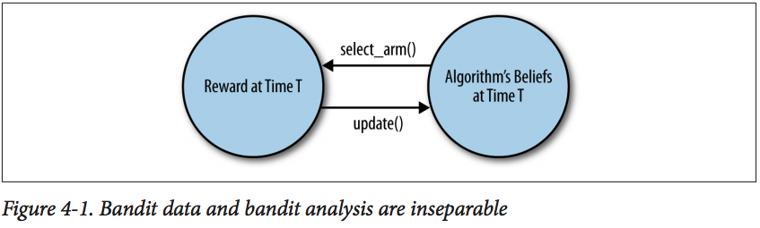

# Chapter 4
## Debugging Bandit Algorithms 
### Monte Carlo Simulations are like Unit Tests for Bandit Algorithms

Bandit algorithms are not like standard machine learning tools
* bandit algorithms have to actively select which data you should acquire
* ...and analyze that data in real-time 
* exmplifies **active learning**
  * algorithms that actively select which data they should receive
* and **online learning**
  * algorithms that analyze data in real-time and provide results on the fly

Therefore, a complicated feedback cycle as such:



* Bandit Algorithm
* Simulation of the bandit's arms that the algorithm has to select between

The two pieces of code specified above will work together to generate an example of how the algorithm might really function in production.
* Each simulation powered by random numbers.

### Simulating the arms of a bandit problem

For this book, the focus will be on a very simple type of simulated arm that's easy to implement **correctly**. Ex):
* Optimizing click-through rates for ads
  * We'll imagine there's a fixed probability an ad will be clicked. 
  * The algorithm then estimates this probability and decides on a strategy to show ads that maximizes the CTR
* Conversion rates for new users
  * Imagine a fixed probability they'll convert (ex register)
  * Try to maximize the CVR

The stimulated arm is going to be called a **Bernoulli arm**.
* a jargony way of saying:
  * rewards you with value of 1 some percentage of the time
  * rewards you with value 0 rest of the time

This **0/1** framework is a simple way to simulate click-throughs or conversions.
* Clicked? 1 No? 0
* Registered? 1 No? 0

The implementation of Bernoulli arm:
```python
class BernoulliArm():
  def __init__(self, p):
    self.p = p

  def draw(self):
    if random.random() > self.p:
      return 0.0
    else:
      return 1.0
```
**p** : probability of getting a reward of 1 from that arm

**draw** : a method, when called, produces 1 unit of reward with probability p

The missing aspect: we typically have to work with many arms, so an **array of Arm objects** is needed:
```python
means = [0.1, 0.1, 0.1, 0.1, 0.9]
n_arms = len(means)
random.shuffle(means)
arms = map(lambda (mu): BernoulliArm(mu), means)
```
The above code sets an array that contains 5 arms:
* 4 of them ouput reward 10% of the time
* The best (1) of them outputs reward 90% of the time

The Bernoulli arms may be tried out as follows:
```python
arms[0].draw()
arms[1].draw()
arms[2].draw()
```

and the typical output may look like:
```python
>>> arms[0].draw()
1.0
>>> arms[1].draw()
0.0
>>> arms[2].draw()
0.0
```

Before experimenting with the epsilon-Greedy algorithm, a generic framework for testing an algorithm needs to be setup.
* Called the `test_algorithm` function
* will be the only testing tool needed for the REST OF THIS BOOK

```python
def test_algorithm(algo, arms, num_sims, horizon):
  chosen_arms = [0.0 for i in range(num_sims * horizon)]
  rewards = [0.0 for i in range(num_sims * horizon)]
  cumulative_rewards = [0.0 for i in range(num_sims * horizon)]
  sim_nums = [0.0 for i in range(num_sims * horizon)]
  times = [0.0 for i in range(num_sims * horizon)]
  
  for sim in range(num_sims):
    sim = sim + 1
    algo.initialize(len(arms))

    for t in range(horizon):
      t = t + 1
      index = (sim - 1) * horizon + t - 1
    
      sim_nums[index] = sim
      times[index] = t
 
      chosen_arm = algo.select_arm()
      chosen_arms[index] = chosen_arm
 
      reward = arms[chosen_arms[index]].draw()
      rewards[index] = reward
 
      if t == 1:
        cumulative_rewards[index] = reward
      else:
        cumulative_rewards[index] = cumulative_rewards[index - 1] + reward
 
      algo.update(chosen_arm, reward)
 
  return [sim_nums, times, chosen_arms, rewards, cumulative_rewards]
```
The objects that are passed as parameters:
* `algo` : The bandit algorithm we want to test
* `arms` : An array of arms we want to simulate draws from
* `num_sims` : A fixed number of simulations to run to average over the noise in each simulation
* `horizon` : The number of times each algorithm is allowed to pull on arms during each simulation.
  * any algorithm will eventually learn its best arm if not terrible
  * Interesting to study whether an algorithm does well when it only has 100 (or 100,000) tries to find the best arm.

The framework then uses these objects to run independent simulations. For each simulation:
* Initializes the bandit algorithm’s settings from scratch so that it has no prior knowledge about which arm is best.
* Loops over opportunities to pull an arm. On each step of this loop, it:
  * calls `select_arm` to see which arm the algorithm chooses
  * calls `draw` on that arm to simulate the result of pulling that arm
  * records the amount of reward receuved by the algorithm and then calls `update` to let the algorithm process that new piece of information.

The testing framework then returns a data set that tells us for each simulation WHICH arm was chosen, and HOW WELL the algorithm did at each point of time.

The code below shows an example of how this framework could be used, using the `epsilon-Greedy algorithm` implemented earlier and the five Bernoulli arms defined a moment ago.

All necessary code were reproduced.
```python
execfile("core.py")

import random

random.seed(1)
means = [0.1, 0.1, 0.1, 0.1, 0.9]
n_arms = len(means)
random.shuffle(means)
arms = map(lambda (mu): BernoulliArm(mu), means)
print("Best arm is " + str(ind_max(means)))

f = open("algorithms/epsilon_greedy/standard_results.tsv", "w")

for epsilon in [0.1, 0.2, 0.3, 0.4, 0.5]:
  algo = EpsilonGreedy(epsilon, [], [])
  algo.initialize(n_arms)
  results = test_algorithm(algo, arms, 5000, 250)
  for i in range(len(results[0])):
    f.write(str(epsilon) + "\t")
    f.write("\t".join([str(results[j][i]) for j in range(len(results))]) + "\n")

f.close()
```
### Analyzing Results from a Monte Carlo Study

Approach 1: Track the probability of choosing the best arm
* keeping track of odds that our algorithm selects the best arm at any given point in time
  * the algorithm uses randomization, and may therefore not select the best arm even after it's learned which arm is best
  * rewards that the algorithm receives are random as well.
* The probability that the algorithmpicks the best arm should go over time
  * else no evidence that the algorithm is learning anything about the values of the arms.

(((((((IMAGE)))))))

x-axis: number of times the algorithm has been able to pull on any of the five arms that are available.

y-axis: probability that the algorithm will choose the best of the five arms when `select_arm` is called.

Actual values of the curves are averages across 5000 simulations.

Each setting of epsilon produce a separate curve.
* high values go up quickly and peak out
  * best arm if found quickly (explored a lot), but explores even after finding the best arm. 
* low value of epsilon explores slowly
  * but eventually reaches a higher peak performance level.

Approach 2: Track the Average Reward at Each Point in Time.
(((IMAGE)))

Similar Results to approach 1:
* as the rewards are so far apart
* the rewards are all 0's or 1's

Approach 3: Track the Cumulative Reward at Each point in Time.
(((Image)))

Curves for the low value of epsilon = 0.1 and the high value of epsilon = 0.5 intersect after about 130 rounds.
* Explore -> Exploit sequence is really better.

Basically, all approaches show that epsilon-Greedy algorithm **does** eventually find the best arm no matter the value of `epsilon`. But the length of time required differs.

