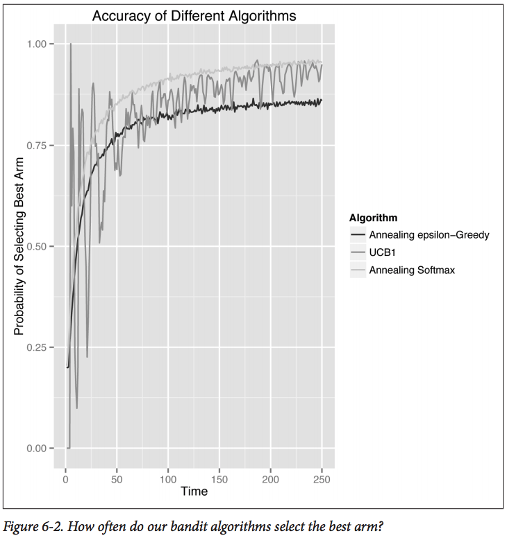

# Chapter 6
## UCB - The Upper Confidence Bound Algorithm
### Introducing the UCB Algorithm

Algorithms presented so far (epsilon-Greedy, Softmax):
* don't keep track of how much they know about the arms available to the,
* only about **how much rewad they've gotten from the arms**.
  * will UNDERexplore options whose initial experiences were not rewarding

**UCB**
* pays attention to not only *what is knows* but also *how much it knows*.

Epsilon-Greedy Algorithm and Softmax algorithm share the following properties:
* Default choice is to select the arm that currently has the highest estimated value
* The algorithm sometimes decides to explore and chooses an option that isn't the one that currently seems the best:
  * epsilon-Greedy explores by selecting from ALL arms COMPLETELY at random. (explores at probability *epsilon*)
  * Softmax explores by randomly selecting from all the available arms 
    * with probabilities approx. proportional to the estimated value of each of the arms.
* In order to explore LESS over time for maximum performance, both algorithms can be set up to modify their basic parameters dynamically over time (annealing)

UCB can improve from the above by **keeping track of the confidence in the values of the arms**
* the values are noisy - the estimates will always be noisy estimates
  * it might be just coincidence that one arm looks better than another arm
* Take advantage of the *counts* information

UCB is a FAMILY of algorithms
* will just be looking at `UCB1` algorithm in this book.
  * Assumes that the maximum possible reward has value 1

UCB is special for two other reasons:
1. does not use randomness at all. Possible to know exactly how UCB will behave in any given situation.
2. does not have free parameters that need to be configured for deployment. i.e. UCB can be used without having a clear sense of what you expect the world to behave like.

In short:
1. Use of explicit use of confidence
2. Absence of unnecessary randomness
3. Absence of configurable parameters

### Implementing UCB

Implementing a class to store all the information to be kept track of:
```python
class UCB1():
  def __init__(self, counts, values):
    self.counts = counts
    self.values = values
    return
 
def initialize(self, n_arms):
  self.counts = [0 for col in range(n_arms)]
  self.values = [0.0 for col in range(n_arms)]
  return
```
Doesn't have any extra parameters compared to the previous 2 algorithms.
* UCB just EXPLOITS the ccounts field.

Implementation of `select_arm` and `update`:
```python
def select_arm(self):
  n_arms = len(self.counts)
  for arm in range(n_arms):
    if self.counts[arm] == 0:
      return arm
 
  ucb_values = [0.0 for arm in range(n_arms)]
  total_counts = sum(self.counts)
  for arm in range(n_arms):
    bonus = math.sqrt((2 * math.log(total_counts)) / float(self.counts[arm]))
    ucb_values[arm] = self.values[arm] + bonus
  return ind_max(ucb_values)
 
def update(self, chosen_arm, reward):
  self.counts[chosen_arm] = self.counts[chosen_arm] + 1
  n = self.counts[chosen_arm]
 
  value = self.values[chosen_arm]
  new_value = ((n - 1) / float(n)) * value + (1 / float(n)) * reward
  self.values[chosen_arm] = new_value
  return
```
* Makes sure each single arm has been played at least once
  * Prevents total cold start before applying confidence-based decision rule
  * if `number of plays` < `number of arms`, may not even make it to the end.
  * Else, effective when there are clearly inferior arms that can be ignored from the start.
* `ucb_value` combines simple estimated value with a special bonus quantity
  * bonus = `math.sqrt((2 * math.log(total_counts)) / float(self.counts[arm]))`
  * Larger bonus for smaller `counts[arm]`
  * Means that we try hard to learn about arms if we don't know ENOUGH about them
    * Even visits the worst of the arms occasionally.
  * This curiosity bonus means that UCB can behave in very surprising ways.
* Other factors are rescaling terms
  * Allows algorithm to define a **confidence interval** that has a reasonable chance of containing the true value of the arm inside of it
  * UCB creates its `ucb_values` by replacing every arm's estimated value with the upper bound on the confidence interval for its value
    * Thus called the ***Upper Confidence Bound*** Algorithm


This graph looks very noisy compared to the graphs of previous algorithms:
* The little dips in the graph are from the UCB backpedaling and experimenting with inferior arms because it comes to the conclusion that it knows too little about those arms.
* Matters less and less over time, but always present in UCB's behaviour
  * UCB does not become a strictly greedy algorithm even if you have a huge amount of data.

### Comparing Bandit Algorithms Side-by-Side
Focus on ANNEALING versions of epsilon-Greedy and Softmax alongside UCB1.
* makes comparison simpler, removes parameters that have to be tuned for the algorithms to do their best.
* Uses the same 3 approaches.


* UCB1 looks much noisier than epsilon-Greedy or Softmax
* epsilon-Greedy doesn't converge as quickly as the Softmax algorithm
  * Need to use another annealing schedule, or
  * epsilon-Greedy algorithm is simply inferior to Softmax algorithm
* UCB1 takes a while to catch up with the annealing Softmax algorithm
  * but does start to catch up right near the end of the plays simulated
  * UCB1 might outperform Softmax unambiguously in other environments
* UCB1 find the best arm very quickly, but the backpedaling causes it to underperform the Softmax algorithm along most metrics.

Similar stories are told by the average reward and cumulative reward.


